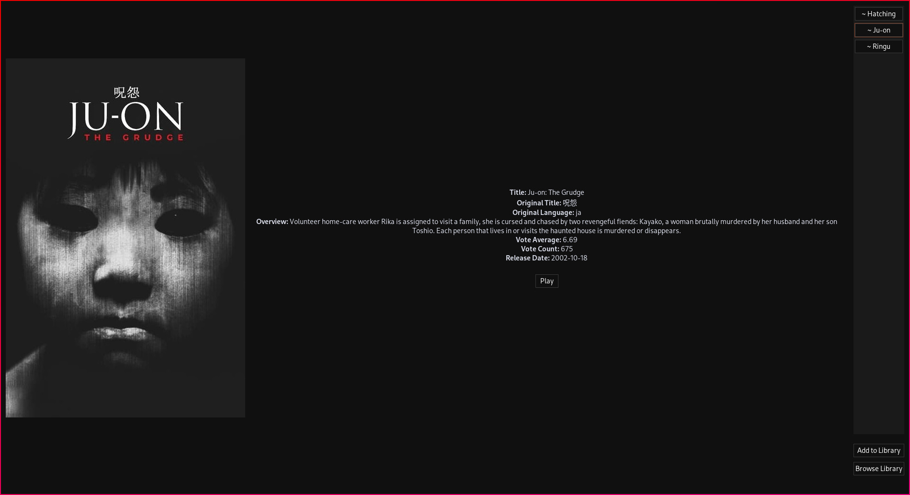

## reel_hub
This is a gtk movie library browser written in rust. 

## Features
 - Fetching data from <b>tmdb api</b> 
	- poster
	- original title and language
	- overview
	- vote average and count
	- release date
 - Playing the selected movie in <b>mpv</b>

## Installation
Clone this repository first:
```sh
git clone https://github.com/ShiNoNeko47/reel_hub
```
---
If you just want to run the app:
```sh
cd reel_hub && cargo run -r
```
---
To make it accessible your from application menu, first compile binary using
```sh
cd reel_hub && cargo build -r
```
then copy the following:
```
[Desktop Entry]
Type = Application
Name = reel_hub
Exec = reel_hub
```
to ```XDG_DATA_HOME/applications/reel_hub.desktop``` and <b>either</b>
replace ```Exec = reel_hub```
with ```Exec = FULL_PATH_TO_BINARY``` eg. ```Exec = /home/user/reel_hub/target/reel_hub```
<b>or</b>
place the binary on path 

## Setup

To get started add movies to ```XDG_DATA_HOME``` or make a symlink to a directory that contains movies

## Screenshot

